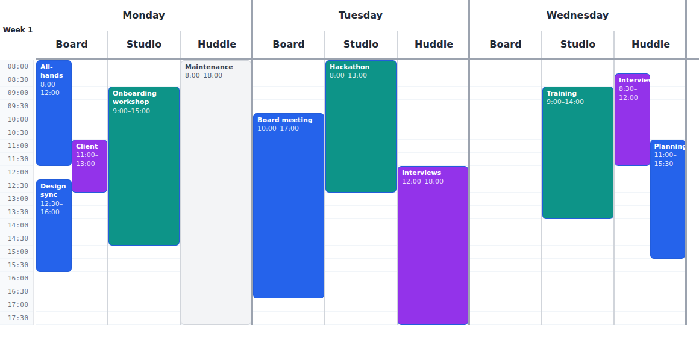

# resource-scheduler

A React time grid with one column per resource (a person, room, machine…),
events positioned by time, overlapping events laid out side by side, and drag
and drop to move, reassign and resize them.

<picture>
  <source media="(prefers-color-scheme: dark)" srcset="docs/screenshot-dark.png">
  
</picture>

> Status: extracted from simple-retail-planner; not yet published to npm.

**Live demo:** https://nicholasjstock.github.io/resource-scheduler/ — a week of meeting-room
bookings: drag them between times and rooms, resize them, book a room by clicking an empty slot, and
switch between light and dark. Moves onto a room's locked maintenance block are rejected and roll back. The source is in
[`demo/`](demo/); run it locally with `npm run demo`.

## Usage

```tsx
import { ResourceScheduler, type SchedulerColumn } from '@nicholasjstock/resource-scheduler'
import '@nicholasjstock/resource-scheduler/style.css'

type Booking = { id: string; start: Date; end: Date; roomId: string; title: string }

const room = (roomId: string): SchedulerColumn<Booking, { roomId: string }> => ({
  id: `mon-${roomId}`,
  title: roomId,
  data: { roomId },
  filterEvents: (events) => events.filter((e) => e.roomId === roomId),
})

<ResourceScheduler
  columns={[{ id: 'mon', title: 'Monday', date: monday, children: [room('A'), room('B')] }]}
  events={bookings}
  timeAxis={{ startHour: 8, endHour: 20, slotMinutes: 30 }}
  columnWidth={160}
  slotHeight={24}
  renderEvent={(booking, ctx) => (
    <div>
      {booking.title}
      <div {...ctx.resizeHandleProps} style={{ position: 'absolute', bottom: 0, height: 6, left: 0, right: 0 }} />
    </div>
  )}
  onEventMove={async ({ event, start, end, toColumn }) => {
    await api.move(event.id, { start, end, roomId: toColumn?.data?.roomId })
  }}
  onEventResize={({ event, end }) => api.resize(event.id, end)}
  onSlotClick={({ start, column }) => openCreateDialog(start, column.data?.roomId)}
/>
```

- **Columns** form a tree (e.g. day → area → person). Leaf columns hold the
  grid; a column's `date` is inherited by its children; `filterEvents`
  narrows the events passed down; `data` comes back in callbacks.
- **Events** are read with `accessors` (`getId`, `getStart`, `getEnd`,
  `isEditable`); by default `id`, `start`, `end` and `editable`.
- **Moves and resizes are optimistic**: return a promise from `onEventMove` /
  `onEventResize` and the event stays at its new position until it settles;
  reject to roll back.
- **Theming**: `theme="light"` (default), `"dark"` or `"auto"` (follows
  `prefers-color-scheme`). Fine-tune with the `--rs-*` custom properties (see
  `src/components/resource-scheduler.css`) via the `style` prop or a
  `className` rule on the scheduler.
- **Slots**: `corner` (top-left cell) and `renderColumnHeader(column, { depth, defaultContent })`.

## Development

```bash
npm install
npm test          # Vitest browser mode (Playwright/Chromium)
npm run typecheck
npm run build     # tsup → dist/ (ESM + .d.ts + index.css)
npm run screenshot  # regenerate docs/screenshot-{light,dark}.png (scripts/readme-screenshot.test.tsx)
npm run demo        # live demo dev server (demo/)
npm run build:demo  # static demo site → demo-dist/ (deployed to GitHub Pages by .github/workflows/pages.yml)
```

## Licence

MIT — see [LICENSE](LICENSE).
